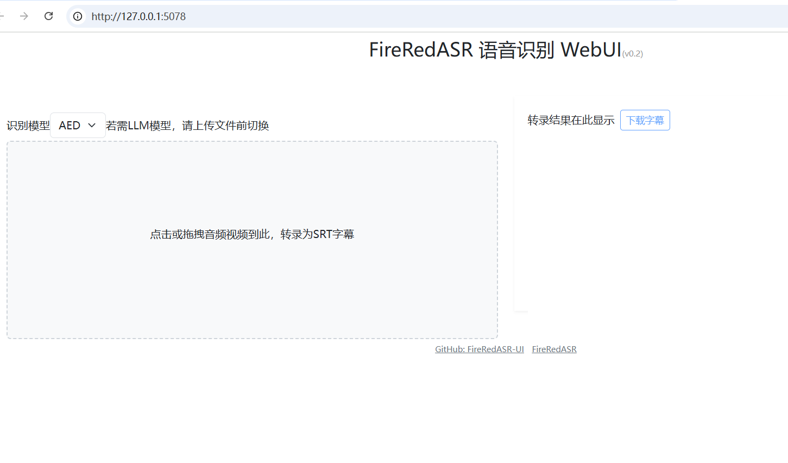
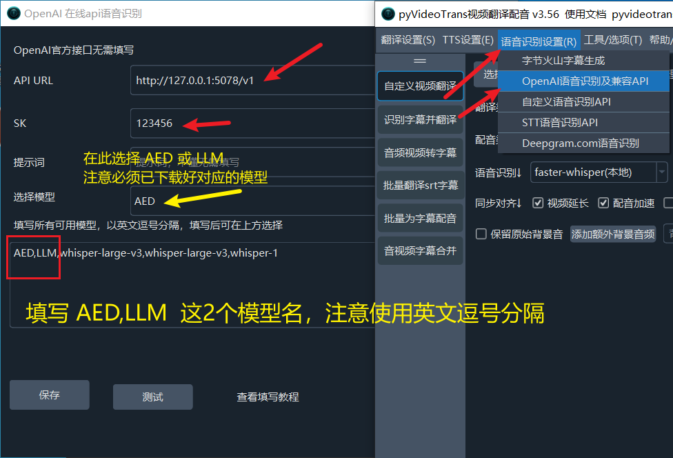

# FireRedASR2S WebUI (fireredasr2s-ui)

基于 [FireRedASR2S](https://github.com/FireRedTeam/FireRedASR2S) 的 WebUI 与 OpenAI 兼容 API 项目。
WebUI 的实现参考了 [jianchang512/fireredasr-ui](https://github.com/jianchang512/fireredasr-ui)。

> ⚠️ **本仓库专门针对 Windows 部署设计**，仅提供 Windows 下的安装与使用说明。

## 功能特性

- WebUI 界面：拖拽/选择音视频文件，一键转写为 SRT 字幕
- OpenAI 兼容 API：`POST /v1/audio/transcriptions`（支持 srt / json / text 格式）
- 支持 FireRedASR2-LLM（推荐，精度最强）与 FireRedASR2-AED 两种模型
- 内置 FireRedASR2S 官方推理包与命令行工具（可输出 SRT / TextGrid / JSONL）

## WebUI 预览



## 环境要求（Windows）

- Windows 10/11 x64
- NVIDIA 显卡 + 最新驱动（LLM 模型建议 ≥24GB 显存；32GB 显存下以 bf16 半精度运行）
- [uv](https://docs.astral.sh/uv/)：用全局安装的 uv 创建项目本地 venv（`.venv`），不污染全局 Python 环境
- ffmpeg：将 `ffmpeg.exe`、`ffprobe.exe` 及其 DLL 放入仓库根目录的 `ffmpeg/` 文件夹（`app.py` 启动时会自动加入 PATH）。该目录克隆后为空，详见 [`ffmpeg/README.md`](./ffmpeg/README.md)

## 安装（Windows）

1. 拉取源码：`git clone https://github.com/lumina37/fireredasr2s-ui.git`
2. 进入目录：`cd fireredasr2s-ui`
3. 安装依赖（自动创建 `.venv` 并安装全部依赖）：

   ```
   uv sync
   ```

4. 按下方说明下载模型，放入 `pretrained_models/` 对应目录（各目录内附有 `*下载地址.txt` 说明）

### 模型下载

- **FireRedASR2-LLM（推荐）**：将 [FireRedASR2-LLM](https://huggingface.co/FireRedTeam/FireRedASR2-LLM) 仓库中的 `model.pth.tar`、`asr_encoder.pth.tar`、`cmvn.ark` 放入 `pretrained_models/FireRedASR2-LLM-L/`
- **Qwen2-7B-Instruct**：将 [Qwen2-7B-Instruct](https://huggingface.co/Qwen/Qwen2-7B-Instruct) 中的 4 个 `model-0000X-of-00004.safetensors` 及相关配置文件放入 `pretrained_models/FireRedASR2-LLM-L/Qwen2-7B-Instruct/`
- **FireRedASR2-AED（可选）**：将 [FireRedASR2-AED](https://huggingface.co/FireRedTeam/FireRedASR2-AED) 中的文件放入 `pretrained_models/FireRedASR2-AED-L/`

> 模型托管在 huggingface.co，国内用户可将链接中的 `huggingface.co` 替换为 `hf-mirror.com` 加速下载。

## 启动

双击 `run_webui.cmd`，或命令行执行：

```
.venv\Scripts\python.exe app.py
```

启动后自动打开浏览器访问 http://127.0.0.1:5078

## API 地址

默认地址：http://127.0.0.1:5078/v1

**OpenAI SDK 中使用**

```python
from openai import OpenAI
client = OpenAI(api_key='123456',
    base_url='http://127.0.0.1:5078/v1')

audio_file = open("5.wav", "rb")
transcript = client.audio.transcriptions.create(
  model="whisper-1",
  file=audio_file,
  response_format="json",
  timeout=86400
)

print(transcript.text)
```

## 在 pyVideoTrans 中使用

在 `OpenAI语音识别及兼容API` 中填写，然后在语音识别渠道中选择 `OpenAI语音识别`。



## 命令行转写（CLI）

```
.venv\Scripts\python.exe -m fireredasr2s.fireredasr2s_cli --wav_path input.wav --asr_type llm --asr_model_dir pretrained_models/FireRedASR2-LLM-L --asr_use_half 1 --enable_vad 0 --enable_lid 0 --enable_punc 0 --write_srt 1 --write_textgrid 0 --outdir output
```

详细用法见仓库内技能文档：`.dsh/skills/fireredasr2s-cli/SKILL.md`

## Acknowledgements

- [FireRedASR2S](https://github.com/FireRedTeam/FireRedASR2S)：推理后端
- WebUI 实现参考了 [jianchang512/fireredasr-ui](https://github.com/jianchang512/fireredasr-ui)
